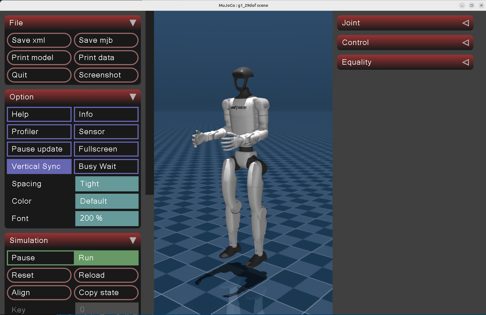

# Introduction
## Unitree mujoco
This is a streamlined version of the unitree_mujoco repository by unitree, built and run using Docker. 

## Usage

Clone the repo with submodules:
```
git clone --recurse-submodules https://github.com/Abanesjo/unitree_mujoco
cd unitree_mujoco
./build_and_run.sh
```

This builds the Docker image and launches the C++ MuJoCo simulator with GPU passthrough and X11 forwarding. On first run the build will take a while because it compiles MuJoCo and the Unitree SDK v2 from source; subsequent runs reuse the cached image.

You will see the below window

<p align="center">
    
</p>

By default the robot's pelvis is fixed mid-air.

### Configuration

Simulator settings live in `simulate/config.yaml` (robot selection, DDS domain/interface, joystick, elastic band, etc.). The file is volume-mounted, so edits on the host take effect on the next launch — no rebuild needed. CLI flags passed to the container can override any field via `boost::program_options`.

Robot models live under `unitree_robots/` and terrain generation lives under `terrain_tool/`. Both are volume-mounted as well, so you can edit XML scenes or regenerate terrain without rebuilding the image.

## ROS Interface

**Subscribed Topics**

- /lowcmd 

**Published Topics**
- /lowstate

Please refer to the main repo for other usage guidelines. 
